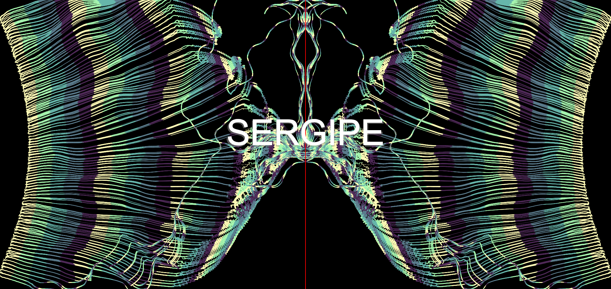
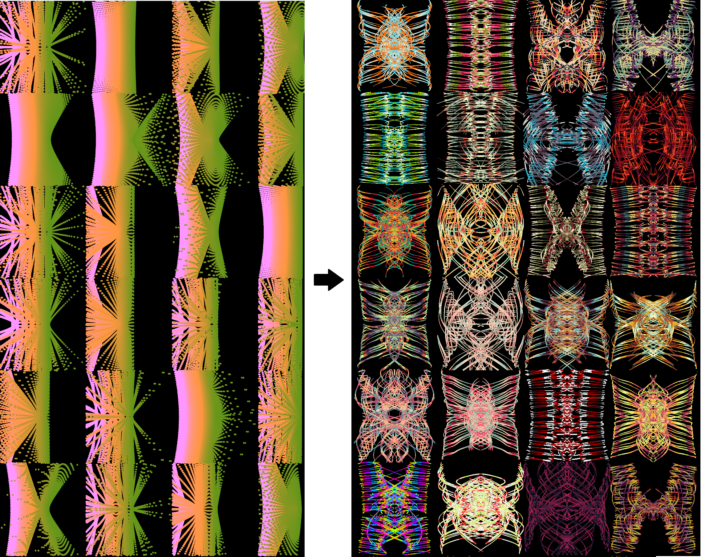

# Submissão Hiperbólica (NANO 2022)

Centenas de elementos conduzidos por uma hipérbole se desdobram em uma visualização abstrata. Dado o tema, propus que a fonte mais adequada para guiar os elementos é próprio Brasil, país de muitos e de muitas (em todos os sentidos), construído pela ordem caótica de sua própria população. Sob esta óptica, utilizei uma massa de dados do IBGE para alimentar os parâmetros do <em>sketch</em>, imprimindo uma estética levemente única para cada imagem. 

Talvez o ponto mais ambíguo seja a linha que separa a hipérbole (curva geométrica) da hipérbole (figura de linguagem), ambas existem no <em>sketch</em>, mas onde exatamente?

Um exemplo:

Edit: 09/08/20200 - Reformulação

Após a submissão inicial, me peguei pensando sobre a obra e como cada estado deveria ter uma assinatura realmente "única". Isso seria basicamente inatingível utilizando variáveis que dependiam puramente da aleatoriedade (mais especificamente, da função random). Consequentemente, restringi o uso de função para o mínimo possível. Isso levou a uma equalização de algumas "assinaturas hiperbólicas" dos padrões gerados, o que é um problema, pois acabaria gerando resultados similares e, ultimamente, não únicos. Além disso, visualizar uma imagem por vez não me permitia ver se os novos testes estavam levando à diferenças interessantes.

Isso me obrigou a voltar para a prancheta e repensar a estratégia para gerar as trajetórias e avaliar as hipérboles simultaneamente. Por fim gerei um programa para avaliar o máximo de curvas possíveis, carregando os dados do IBGE e visualizando a "assinatura hiperbólica" ao longo do tempo de execução:

Combinando todos esses fatores, foi possível refinar o programa final e ainda adequar o modo de desenho para uma trajetória mais suave e menos (propositadamente) exata, refletindo nossa própria natureza brasileira. Ao final, nos resta uma espécie de dança que é, simultaneamente, ordenada e caótica, espelho de nossa própria construção. O resultado, pode ser visto abaixo:

[Link do Sketch](https://mateusberruezo.github.io/Nano2022/NANO3/index.html)
